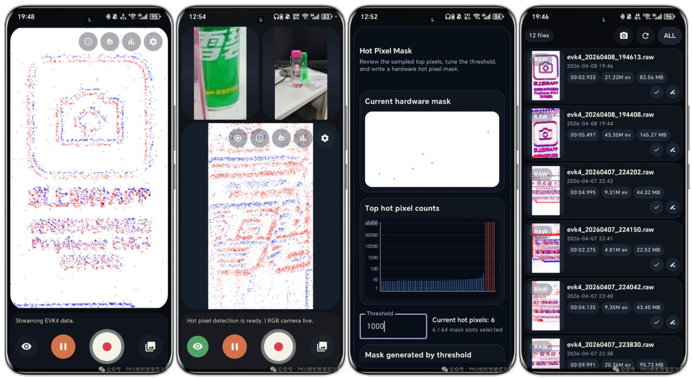
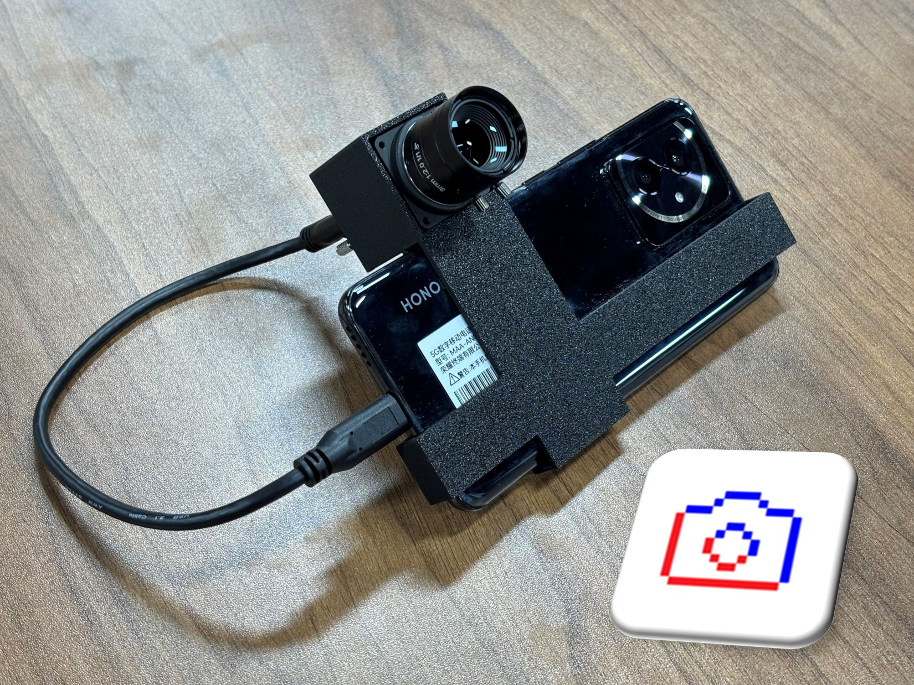

# EvHandy: Event cameras handy on your phone!

EvHandy is an Android app for using event cameras directly from a phone. It supports live event preview, RAW event recording, recording management, playback, sharing, and optional RGB reference capture from the phone camera.

Demo videos:

Youtube (English): https://www.youtube.com/watch?v=dlwvo82HPqk

<iframe width="560" height="315" src="https://www.youtube.com/embed/dlwvo82HPqk?si=RYa1vAn5-FWw0xTo" title="
EvHandy Demo: Use your event camera with your phone!" frameborder="0" allow="accelerometer; autoplay; clipboard-write; encrypted-media; gyroscope; picture-in-picture; web-share" referrerpolicy="strict-origin-when-cross-origin" allowfullscreen></iframe>

Bilibili (Chinese): https://www.bilibili.com/video/BV1JrDBBiEtH

<iframe src="//player.bilibili.com/player.html?isOutside=true&aid=116364740135532&bvid=BV1JrDBBiEtH&cid=37321836891&p=1" scrolling="no" border="0" frameborder="no" framespacing="0" allowfullscreen="true"></iframe>

We sincerely thank our supporters:

| Logo | Company | Homepage |
| --- | --- | --- |
|  | Fluxeem / 瞬极科技 | [fluxeem.com](https://www.fluxeem.com/) |

## Features

- Live preview from supported USB event cameras.
- RAW event recording on the phone.
- Timed recording with configurable start delay and duration.
- In-app gallery for browsing, renaming, deleting, and sharing recordings.
- Playback with event-density and recent-activity visual modes.
- Event playback with time-based slicing and event-count-based slicing.
- Optional phone RGB camera preview, linked RGB recording, and RGB/event alignment.
- Camera settings for bias offsets, anti-flicker filtering, trail filtering, event rate control, ROI, hot-pixel masking, and stream configuration.
- English and Chinese interface languages.

  

    
     <em>EvHandy Screenshots</em>
  

  

    
     <em>Hardware system demo</em>
  

## Supported Cameras

Current supported camera models:

- Fluxeem ApexVision-S1
- Prophesee EVK4

## Phone and Cable Requirements

For high-throughput event recording, use a phone with a USB 3.0 or newer port, together with a USB 3-compatible cable or adapter. High event-rate scenes can exceed the practical bandwidth of USB 2 connections and may lead to dropped events.

If your phone does not support USB 3.0 or newer, enable Event Rate Control (ERC) in camera settings and set `ERC CD Event Count` to `2000`. This limits the event output rate so the stream stays within the available USB bandwidth.

## Installation

1. Download the latest EvHandy APK from the GitHub Releases page.
2. Install the APK on your Android phone. If Android asks for permission to install apps from the browser or file manager, allow it for the app you are using to open the APK.
3. Open EvHandy.
4. On first launch, enter the recording author email and accept the license agreement. The author email is stored locally and written into newly created RAW recording metadata.

## Basic Use

1. Connect a supported event camera to the phone with a USB OTG-capable cable or adapter.
2. Grant USB permission when Android asks.
3. Wait for the camera status to show that the device is ready.
4. Tap the streaming/start button to begin streaming events for preview.
5. Tap the record button to start or stop RAW event recording.
6. Open the gallery to review, play back, rename, delete, or share recordings.

## Recording Tips

- Use USB 3.0 or newer phones for scenes with high event activity.
- On non-USB3 phones, enable ERC and set `ERC CD Event Count` to `2000`.
- Use timed recording when you need a fixed capture duration or a delayed start.
- Keep enough free storage available before long recordings.

## Preview Performance Tips

Preview rendering can be adjusted independently from the data being recorded.

To reduce preview CPU/GPU load, lower these settings:

- `Preview FPS`
- `Record FPS`
- `Preview resolution`

These settings affect the on-screen event preview workload only. They do not reduce the events saved into RAW recordings, and they do not change the linked RGB video that is recorded by the phone camera.

## Playback

Recorded files can be opened from the gallery. Playback supports event-density and recent-activity visualization, timeline navigation, playback statistics, and RGB sync display when a linked RGB recording is available.

Event playback can be sliced in two ways:

- Time mode: split the recording into fixed time intervals.
- Event mode: split the recording by event count. This is useful for focusing on active periods where events are triggered densely.

## Sharing Recordings

From the gallery, select one or more recordings and choose what to share:

- RAW event files
- Linked RGB video files
- All related recording files

Selected files can also be packaged into a zip archive before sharing.

## Contact 👋

💬 Have a question, idea, or bug report? Open an issue and tell us what you found.

📬 Want release notes and updates? Send an email with the subject "subscribe" to [evhandy@163.com](mailto:evhandy@163.com).

⭐ If EvHandy helps your work, a star on this repository would mean a lot.
